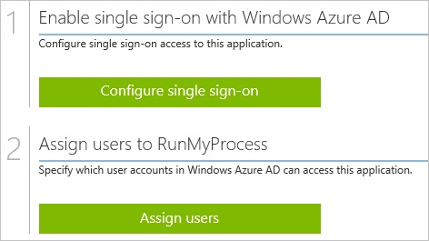
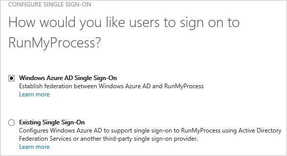
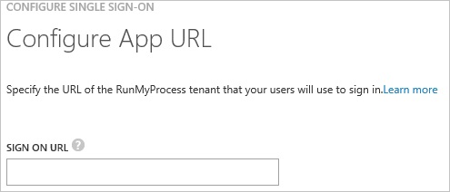
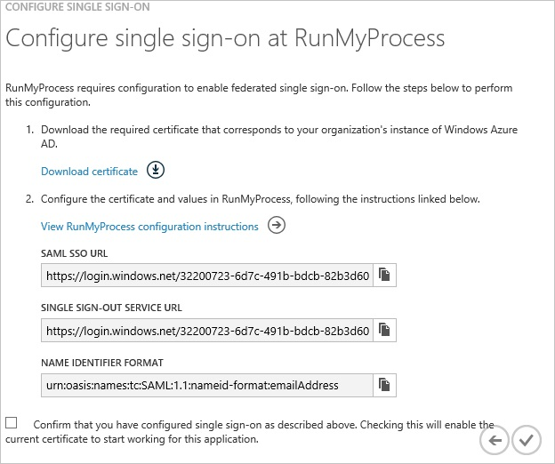
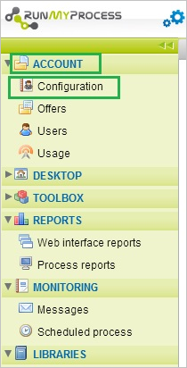
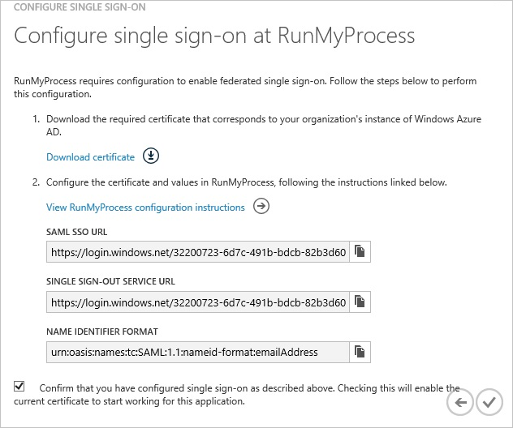
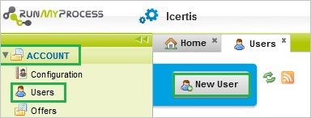
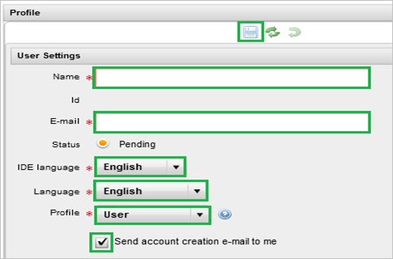

<properties 
    pageTitle="Tutorial: Azure Active Directory integration with RunMyProcess | Microsoft Azure" 
    description="Learn how to use RunMyProcess with Azure Active Directory to enable single sign-on, automated provisioning, and more!" 
    services="active-directory" 
    authors="jeevansd"  
    documentationCenter="na" 
    manager="stevenpo"/>
<tags 
    ms.service="active-directory" 
    ms.devlang="na" 
    ms.topic="article" 
    ms.tgt_pltfrm="na" 
    ms.workload="identity" 
    ms.date="04/06/2016" 
    ms.author="jeedes" />

#Tutorial: Azure Active Directory integration with RunMyProcess
  
The objective of this tutorial is to show the integration of Azure and RunMyProcess.  
The scenario outlined in this tutorial assumes that you already have the following items:

-   A valid Azure subscription
-   A RunMyProcess tenant
  
After completing this tutorial, the Azure AD users you have assigned to RunMyProcess will be able to single sign into the application at your RunMyProcess company site (service provider initiated sign on), or using the [Introduction to the Access Panel](active-directory-saas-access-panel-introduction.md).
  
The scenario outlined in this tutorial consists of the following building blocks:

1.  Enabling the application integration for RunMyProcess
2.  Configuring single sign-on
3.  Configuring user provisioning
4.  Assigning users

##Enabling the application integration for RunMyProcess
  
The objective of this section is to outline how to enable the application integration for RunMyProcess.

###To enable the application integration for RunMyProcess, perform the following steps:

1.  In the Azure Management Portal, on the left navigation pane, click **Active Directory**.

    

2.  From the **Directory** list, select the directory for which you want to enable directory integration.

3.  To open the applications view, in the directory view, click **Applications** in the top menu.

    

4.  Click **Add** at the bottom of the page.

    

5.  On the **What do you want to do** dialog, click **Add an application from the gallery**.

    

6.  In the **search box**, type **RunMyProcess**.

    

7.  In the results pane, select **RunMyProcess**, and then click **Complete** to add the application.

    
##Configuring single sign-on
  
The objective of this section is to outline how to enable users to authenticate to RunMyProcess with their account in Azure AD using federation based on the SAML protocol.  
As part of this procedure, you are required to create a base-64 encoded certificate file.  
If you are not familiar with this procedure, see [How to convert a binary certificate into a text file](http://youtu.be/PlgrzUZ-Y1o).

###To configure single sign-on, perform the following steps:

1.  In the Azure AD portal, on the **RunMyProcess** application integration page, click **Configure single sign-on** to open the **Configure Single Sign On ** dialog.

    

2.  On the **How would you like users to sign on to RunMyProcess** page, select **Microsoft Azure AD Single Sign-On**, and then click **Next**.

    

3.  On the **Configure App URL** page, in the **RunMyProcess Sign On URL** textbox, type your URL using the following pattern "*http://company.runmyprocess.com*", and then click **Next**.

    

4.  On the **Configure single sign-on at RunMyProcess** page, click **Download certificate**, and then save the certificate file on your computer.

    

5.  In a different web browser window, log into your RunMyProcess company site as an administrator.

6.  Go to **Account \> Configuration**.

    

7.  Click the **Authentication method** tab.

8.  In the **Authentication method** section, perform the following steps:

    

    1.  As **Method**, select **SSO with Samlv2**.
    2.  In the Azure portal, on the **Configure single sign-on at RunMyProcess** dialog page, copy the **SAML SSO URL** value, and then paste it into the **SSO redirect** textbox.
    3.  In the Azure portal, on the **Configure single sign-on at RunMyProcess** dialog page, copy the **Single Sign-Out Service URL** value, and then paste it into the **Logout redirect** textbox.
    4.  In the **Name id Format** textbox, type **urn:oasis:names:tc:SAML:1.1:nameid-format:emailAddress**.
    5.  Create a **base-64 encoded** file from your downloaded certificate.  

        >[AZURE.TIP] For more details, see [How to convert a binary certificate into a text file](http://youtu.be/PlgrzUZ-Y1o)

    6.  Open your base-64 encoded certificate in notepad, copy the content of it into your clipboard, and then paste it to the **Certificate** textbox
    7.  Click **Save**.

9.  On the Azure AD portal, select the single sign-on configuration confirmation, and then click **Complete** to close the **Configure Single Sign On** dialog.

    
##Configuring user provisioning
  
In order to enable Azure AD users to log into RunMyProcess, they must be provisioned into RunMyProcess.  
In the case of RunMyProcess, provisioning is a manual task.

###To provision a user accounts, perform the following steps:

1.  Log in to your **RunMyProcess** company site as an administrator.

2.  Go to **Account \> Users**, and then click **New User**.

    

3.  In the **User Settings** section, perform the following steps:

    

    1.  Type the **Name** and **E-mail** of a valid AAD account you want to provision into the related textboxes.
    2.  Select an **IDE language**, a **Language** and a **Profile**.
    3.  Select **Send account creation e-mail to me**.
    4.  Click **Save**.

>[AZURE.NOTE]You can use any other RunMyProcess user account creation tools or APIs provided by RunMyProcess to provision Azure Active Directory user accounts.

##Assigning users
  
To test your configuration, you need to grant the Azure AD users you want to allow using your application access to it by assigning them.

###To assign users to RunMyProcess, perform the following steps:

1.  In the Azure AD portal, create a test account.

2.  On the **RunMyProcess **application integration page, click **Assign users**.

    

3.  Select your test user, click **Assign**, and then click **Yes** to confirm your assignment.

    
  
If you want to test your single sign-on settings, open the Access Panel. For more details about the Access Panel, see [Introduction to the Access Panel](active-directory-saas-access-panel-introduction.md).