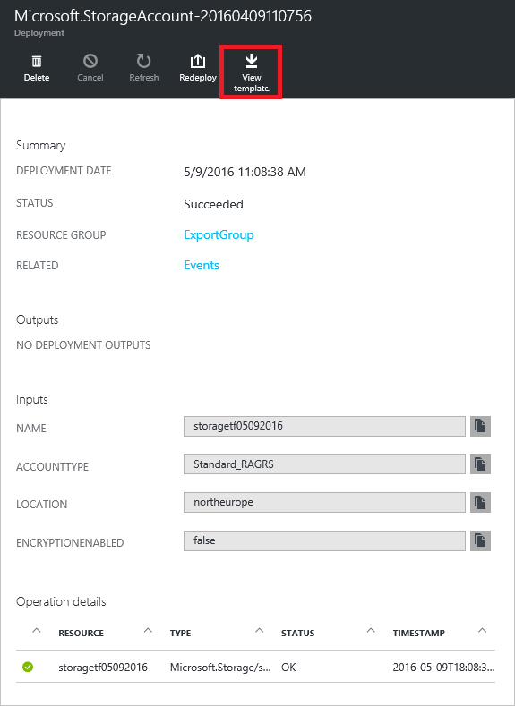
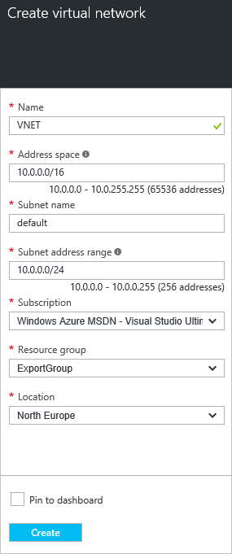
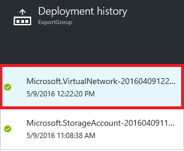
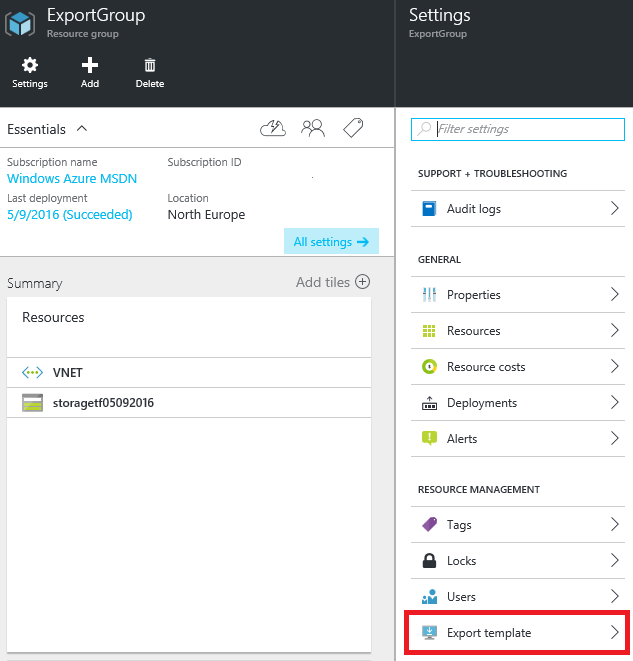

<properties
	pageTitle="Export Azure Resource Manager template | Microsoft Azure"
	description="Use Azure Resource Manage to export a template from an existing resource group."
	services="azure-resource-manager"
	documentationCenter=""
	authors="tfitzmac"
	manager="timlt"
	editor="tysonn"/>

<tags
	ms.service="azure-resource-manager"
	ms.workload="multiple"
	ms.tgt_pltfrm="na"
	ms.devlang="na"
	ms.topic="get-started-article"
	ms.date="05/10/2016"
	ms.author="tomfitz"/>

# Export an Azure Resource Manager template from existing resources

Understanding how to construct Azure Resource Manager templates can be daunting. Fortunately, Resource Manager helps you with that task because you can export a template from existing resources in your subscription. You can use that generated template to learn about the template syntax or to automate the redeployment of your solution as needed.

In this tutorial, you will sign in to the Azure portal, create a storage account, and export the template for that storage account. You will add a virtual network to modify the resource group. Finally, you will export a new template that represents its current state. Although this article focuses on a simplified infrastructure, you could use these same steps to export a template for a more complicated solution.

## Create a storage account

1. In the [Azure portal](https://portal.azure.com), select **New** > **Data + Storage** > **Storage account**.

      

2. Create a storage account with the name **storage**, your initials, and the date. The storage account name must be unique across Azure. If you initially try a name that's already in use, try a variation. For resource group, use **ExportGroup**. You can use the default values for the other properties. Select **Create**.

      

After the deployment finishes, your subscription contains the storage account.

## Export the template for deployment

1. Go to the resource group blade for your new resource group. You will notice that the result of the last deployment is listed. Select this link.

      

2. You will see a history of deployments for the group. In your case, only one deployment is probably listed. Select this deployment.

     

3. A summary of the deployment is displayed. The summary includes the status of the deployment and its operations and the values that you provided for parameters. To see the template that was used for the deployment, select **View template**.

     

4. Resource Manager retrieves the following five files for you:

   - The template that defines the infrastructure for your solution. When you created the storage account through the portal, Resource Manager used a template to deploy it and saved that template for future reference.

   - A parameter file that you can use to pass in values during deployment. It contains the values that you provided during the first deployment, but you can change any of these values when you redeploy the template.

   - An Azure PowerShell script file that you can use to deploy the template.

   - An Azure command-line-interface (CLI) script file that you can use to deploy the template.

   - A .NET class that you can use to deploy the template.

     The files are available through links across the blade. By default, the template is selected.

       

     Let's pay particular attention to the template. Your template should look similar to:

        {
          "$schema": "https://schema.management.azure.com/schemas/2015-01-01/deploymentTemplate.json#",
          "contentVersion": "1.0.0.0",
          "parameters": {
            "name": {
              "type": "String"
            },
            "accountType": {
              "type": "String"
            },
            "location": {
              "type": "String"
            },
            "encryptionEnabled": {
              "defaultValue": false,
              "type": "Bool"
            }
          },
          "resources": [
            {
              "type": "Microsoft.Storage/storageAccounts",
              "sku": {
                "name": "[parameters('accountType')]"
              },
              "kind": "Storage",
              "name": "[parameters('name')]",
              "apiVersion": "2016-01-01",
              "location": "[parameters('location')]",
              "properties": {
                "encryption": {
                  "services": {
                    "blob": {
                      "enabled": "[parameters('encryptionEnabled')]"
                    }
                  },
                  "keySource": "Microsoft.Storage"
                }
              }
            }
          ]
        }

     Notice that the template defines parameters for the storage account name, type, and location. A parameter also indicates whether encryption is enabled, and the default value is **false**. Within the **resources** section, you will see the definition for the storage account to deploy.

Square brackets contain an expression that is evaluated during deployment. The bracketed expressions in the template are used to get parameter values during deployment. You can use many more expressions, and you will see examples of other expressions later in this article. For the complete list, see [Azure Resource Manager template functions](resource-group-template-functions.md).

To learn more about the structure of a template, see [Authoring Azure Resource Manager templates](resource-group-authoring-templates.md).

## Add a virtual network

The template that you downloaded in the previous section represented the infrastructure for that original deployment, but it will not account for any changes you make after the deployment.
To illustrate this issue, let's modify the resource group by adding a virtual network through the portal.

1. In the resource group blade, select **Add**, and then pick **virtual network** from the available resources.

2. Name your virtual network **VNET**, and use the default values for the other properties. Select **Create**.

      

3. After the virtual network has successfully deployed to your resource group, look again at the deployment history. You will now see two deployments. Select the more recent deployment.

      

4. Look at the template for that deployment. Notice that it defines only the changes that you have made to add the virtual network.

It is generally a best practice to work with a template that deploys all the infrastructure for your solution in a single operation rather than remembering many different templates to deploy.

## Export the template for the resource group

Although each deployment shows only the changes that you have made to your resource group, at any time you can export a template to show the attributes of your entire resource group.  

1. To view the template for a resource group, select **Export template**.

      

2. You will again see the five files that you can use to redeploy the solution, but this time the template is a little different. This template has only two parameters: one for the storage account name, and one for the virtual network name.

        "parameters": {
          "virtualNetworks_VNET_name": {
            "defaultValue": "VNET",
            "type": "String"
          },
          "storageAccounts_storagetf05092016_name": {
            "defaultValue": "storagetf05092016",
            "type": "String"
          }
        },

     Resource Manager did not retrieve the templates that were used during deployment. Instead, it generated a new template that's based on the current configuration of the resources. Resource Manager does not know the values that you want to pass in as parameters, so it hard-codes most values based on the values in the resource group. For example, the storage account location and replication value are set to:

        "location": "northeurope",
        "tags": {},
        "properties": {
            "accountType": "Standard_RAGRS"
        },

3. Download the template so that you can work on it locally.

      

4. Find the .zip file that you downloaded and extract the contents. You can use this downloaded template to redeploy your infrastructure.

## Next steps

Congratulations! You have learned how to export a template from resources that you created in the portal.

- In the second part of this tutorial, you will customize the template that you just downloaded by adding more parameters and redeploy it through a script. See [Customize and re-deploy exported template](resource-manager-customize-template.md).
- To see how to export a template through PowerShell, see [Using Azure PowerShell with Azure Resource Manager](powershell-azure-resource-manager.md).
- To see how to export a template through Azure CLI, see [Use the Azure CLI for Mac, Linux, and Windows with Azure Resource Manager](xplat-cli-azure-resource-manager.md).
