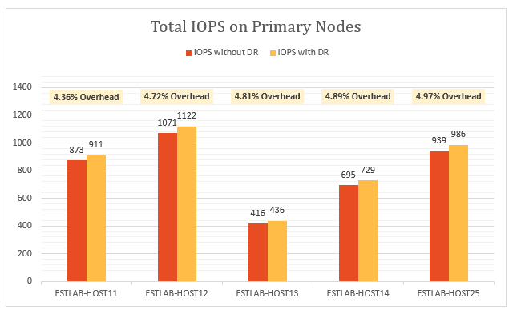
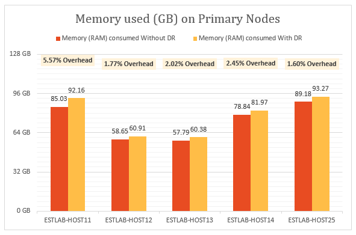
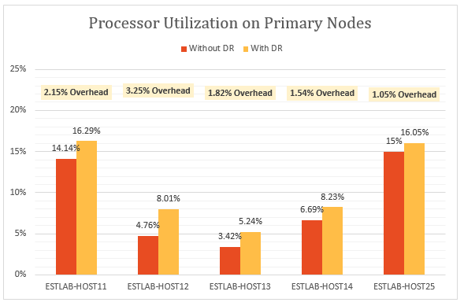
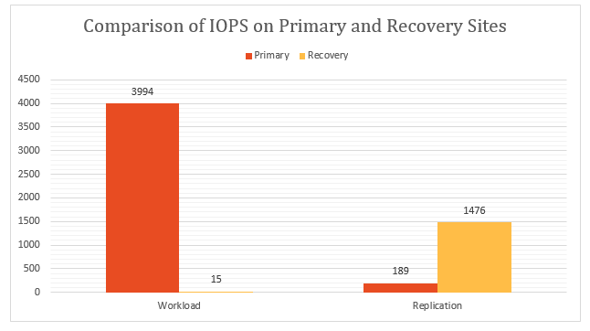
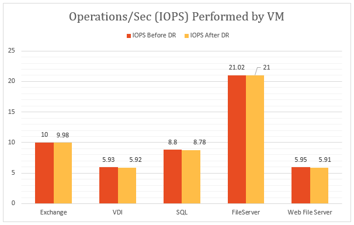
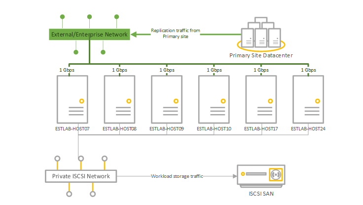

<properties
	pageTitle="Performance test and scale results for on-premises to on-premises Hyper-V replication with Site Recovery | Microsoft Azure"
	description="This article provides information about performance testing for on-premises to on-premises replication using Azure Site Recovery."
	services="site-recovery"
	documentationCenter=""
	authors="rayne-wiselman"
	manager="jwhit"
	editor="tysonn"/>

<tags
	ms.service="site-recovery"
	ms.devlang="na"
	ms.topic="article"
	ms.tgt_pltfrm="na"
	ms.workload="storage-backup-recovery"
	ms.date="12/14/2015"
	ms.author="raynew"/>

# Performance test and scale results for on-premises to on-premises Hyper-V replication with Site Recovery

You can use Microsoft Azure Site Recovery to orchestrate and manage replication of virtual machines and physical servers to Azure, or to a secondary datacenter. This article provides the results of performance testing we did when replicating Hyper-V virtual machines between two on-premises datacenters.

## Overview

The goal of testing was to examine how Azure Site Recovery performs during steady state replication. Steady state replication occurs when virtual machines have completed initial replication and are synchronizing delta changes. It’s important to measure performance using steady state because it’s the state in which most virtual machines remain unless unexpected outages occur.

The test deployment consisted of two on-premises sites with a VMM server in each site. This test deployment is typical of a head office/branch office deployment, with head office acting as the primary site and the branch office as the secondary or recovery site.

### What we did

Here's what we did in the test pass:

1. Created virtual machines using VMM templates.

1. Started virtual machines and capture baseline performance metrics over 12 hours.

1. Created clouds on primary and recovery VMM servers.

1. Configured cloud protection in Azure Site Recovery, including mapping of source and recovery clouds.

1. Enabled protection for virtual machines and allow them to complete initial replication.

1. Waited a couple of hours for system stabilization.

1. Captured performance metrics over 12 hours, ensuring that all virtual machines remained in an expected replication state for those 12 hours.

1. Measure the delta between the baseline performance metrics and the replication performance metrics.

## Test deployment results

### Primary server performance

- Hyper-V Replica asynchronously tracks changes to a log file with minimum storage overhead on the primary server.

- Hyper-V Replica utilizes self-maintained memory cache to minimize IOPS overhead for tracking. It stores writes to the VHDX in memory and flushes them into the log file before the time that the log is sent to the recovery site. A disk flush also happens if the writes hit a predetermined limit.

- The graph below shows the steady state IOPS overhead for replication. We can see that the IOPS overhead due to replication is around 5% which is quite low.

Hyper-V Replica utilizes memory on the primary server to optimize disk performance. As shown in the following graph, memory overhead on all servers in the primary cluster is marginal. The memory overhead shown is the percentage of memory used by replication compared to the total installed memory on the Hyper-V server.

Hyper-V Replica has minimum CPU overhead. As shown in the graph, replication overhead is in the range of 2-3%.

### Secondary (recovery) server performance

Hyper-V Replica uses a small amount of memory on the recovery server to optimize the number of storage operations. The graph summarizes the memory usage on the recovery server. The memory overhead shown is the percentage of memory used by replication compared to the total installed memory on the Hyper-V server.

The amount of I/O operations on the recovery site is a function of the number of write operations on the primary site. Let’s look at the total I/O operations on the recovery site in comparison with the total I/O operations and write operations on the primary site. The graphs show that the total IOPS on the recovery site is

- Around 1.5 times the write IOPS on the primary.

- Around 37% of the total IOPS on the primary site.

### Effect of replication on network utilization

An average of 275 MB per second of network bandwidth was used between the primary and recovery nodes (with compression enabled) against an existing bandwidth of 5 GB per second.

### Effect of replication on virtual machine performance

An important consideration is the impact of replication on production workloads running on the virtual machines. If the primary site is adequately provisioned for replication, there shouldn’t be any impact on the workloads. Hyper-V Replica’s lightweight tracking mechanism ensures that workloads running in the virtual machines are not impacted during steady-state replication. This is illustrated in the following graphs.

This graph shows IOPS performed by virtual machines running different workloads before and after replication was enabled. You can observe that there is no difference between the two.

The following graph shows the throughput of virtual machines running different workloads before and after replication was enabled. You can observe that replication has no significant impact.

### Conclusion

The results clearly show that Azure Site Recovery, coupled with Hyper-V Replica, scales well with minimum overhead for a large cluster.  Azure Site Recovery provides simple deployment, replication, management and monitoring. Hyper-V Replica provides the necessary infrastructure for successful replication scaling. For planning an optimum deployment we suggest you download the [Hyper-V Replica Capacity Planner](https://www.microsoft.com/download/details.aspx?id=39057).

## Test environment details

### Primary site

- The primary site has a cluster containing five Hyper-V servers running 470 virtual machines.

- The virtual machines run different workloads, and all have Azure Site Recovery protection enabled.

- Storage for the cluster node is provided by an iSCSI SAN. Model – Hitachi HUS130.

- Each cluster server has four network cards (NICs) of one Gbps each.

- Two of the network cards are connected to an iSCSI private network and two are connected to an external enterprise network. One of the external networks is reserved for cluster communications only.

|Server|RAM|Model|Processor|Number of processors|NIC|Software|
|---|---|---|---|---|---|---|
|Hyper-V servers in cluster:  ESTLAB-HOST11 ESTLAB-HOST12 ESTLAB-HOST13 ESTLAB-HOST14 ESTLAB-HOST25|128ESTLAB-HOST25 has 256|Dell ™ PowerEdge ™ R820|Intel(R) Xeon(R) CPU E5-4620 0 @ 2.20GHz|4|I Gbps x 4|Windows Server Datacenter 2012 R2 (x64) + Hyper-V role|
|VMM Server|2|||2|1 Gbps|Windows Server Database 2012 R2 (x64) + VMM 2012 R2|

### Secondary (recovery) site

- The secondary site has a six-node failover cluster.

- Storage for the cluster node is provided by an iSCSI SAN. Model – Hitachi HUS130.

|Server|RAM|Model|Processor|Number of processors|NIC|Software|
|---|---|---|---|---|---|---|
|Hyper-V servers in cluster:  ESTLAB-HOST07 ESTLAB-HOST08 ESTLAB-HOST09 ESTLAB-HOST10|96|Dell ™ PowerEdge ™ R720|Intel(R) Xeon(R) CPU E5-2630 0 @ 2.30GHz|2|I Gbps x 4|Windows Server Datacenter 2012 R2 (x64) + Hyper-V role|
|ESTLAB-HOST17|128|Dell ™ PowerEdge ™ R820|Intel(R) Xeon(R) CPU E5-4620 0 @ 2.20GHz|4||Windows Server Datacenter 2012 R2 (x64) + Hyper-V role|
|ESTLAB-HOST24|256|Dell ™ PowerEdge ™ R820|Intel(R) Xeon(R) CPU E5-4620 0 @ 2.20GHz|2||Windows Server Datacenter 2012 R2 (x64) + Hyper-V role|
|VMM Server|2|||2|1 Gbps|Windows Server Database 2012 R2 (x64) + VMM 2012 R2|

### Server workloads

- For test purposes we picked workloads commonly used in enterprise customer scenarios.

- We use [IOMeter](http://www.iometer.org) with the workload characteristic summarized in the table for simulation.

- All IOMeter profiles are set to write random bytes to simulate worst-case write patterns for workloads.

|Workload|I/O size (KB)|% Access|%Read|Outstanding I/Os|I/O pattern|
|---|---|---|---|---|---|
|File Server|48163264|60%20%5%5%10%|80%80%80%80%80%|88888|All 100% random|
|SQL Server (volume 1)SQL Server (volume 2)|864|100%100%|70%0%|88|100% random100% sequential|
|Exchange|32|100%|67%|8|100% random|
|Workstation/VDI|464|66%34%|70%95%|11|Both 100% random|
|Web File Server|4864|33%34%33%|95%95%95%|888|All 75% random|

### Virtual machine configuration

- 470 virtual machines on the primary cluster.

- All virtual machines with VHDX disk.

- Virtual machines running workloads summarized in the table. All were created with VMM templates.

|Workload|# VMs|Minimum RAM (GB)|Maximum RAM (GB)|Logical disk size (GB) per VM|Maximum IOPS|
|---|---|---|---|---|---|
|SQL Server|51|1|4|167|10|
|Exchange Server|71|1|4|552|10|
|File Server|50|1|2|552|22|
|VDI|149|.5|1|80|6|
|Web server|149|.5|1|80|6|
|TOTAL|470|||96.83 TB|4108|

### Azure Site Recovery settings

- Azure Site Recovery was configured for on-premises to on-premises protection

- The VMM server has four clouds configured, containing the Hyper-V cluster servers and their virtual machines.

|Primary VMM cloud|Protected virtual machines in the cloud|Replication frequency|Additional recovery points|
|---|---|---|---|
|PrimaryCloudRpo15m|142|15 mins|None|
|PrimaryCloudRpo30s|47|30 secs|None|
|PrimaryCloudRpo30sArp1|47|30 secs|1|
|PrimaryCloudRpo5m|235|5 mins|None|

### Performance metrics

The table summarizes the performance metrics and counters that were measured in the deployment.

|Metric|Counter|
|---|---|
|CPU|\Processor(_Total)\% Processor Time|
|Available memory|\Memory\Available MBytes|
|IOPS|\PhysicalDisk(_Total)\Disk Transfers/sec|
|VM read (IOPS) operations/sec|\Hyper-V Virtual Storage Device(<VHD>)\Read Operations/Sec|
|VM write (IOPS) operations/sec|\Hyper-V Virtual Storage Device(<VHD>)\Write Operations/S|
|VM read throughput|\Hyper-V Virtual Storage Device(<VHD>)\Read Bytes/sec|
|VM write throughput|\Hyper-V Virtual Storage Device(<VHD>)\Write Bytes/sec|

## Next steps

- [Set up protection between two on-premises VMM sites](site-recovery-vmm-to-vmm.md)
